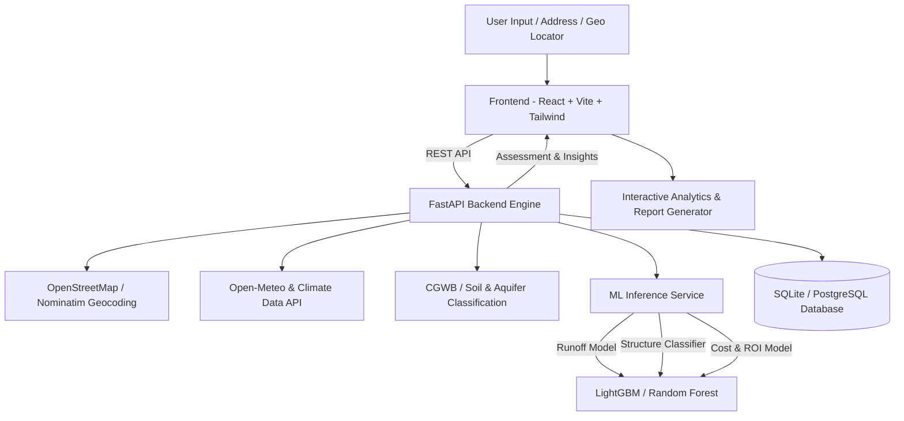

# 🌧️ JalSanrakshak AI (जलसंरक्षक AI)
### 💧 Smart Rooftop Rainwater Harvesting & Artificial Groundwater Recharge Planner

[](https://reactjs.org/)
[](https://fastapi.tiangolo.com/)
[](https://scikit-learn.org/)
[](LICENSE)
[](https://www.sih.gov.in/)

**JalSanrakshak AI** is an intelligent, AI-powered decision-support platform designed for real-time assessment of rooftop rainwater harvesting (RTRWH) and artificial groundwater recharge feasibility. Built for **Smart India Hackathon 2025**, it bridges satellite imagery, meteorological datasets, geological hydro-models, and machine learning into actionable, engineered harvesting roadmaps.

---

## 🌟 Key Highlights

- 🛰️ **Interactive Rooftop & Geo Assessment**: High-precision location detection with direct Google Earth 3D aerial measurement integration.
- 🤖 **Machine Learning Prediction Engine**:
  - Runoff coefficient computation based on roofing materials and age.
  - Harvestable annual water yield calculations ($m^3$ & liters).
  - Multi-structure recommendation (Storage Tanks, Recharge Pits, Trenches, Recharge Shafts).
  - Cost estimations & Payback period ROI simulations.
- 📊 **Dynamic Analytical Dashboards**: Real-time charts for monthly monsoon distribution, cost-benefit projections, and groundwater depth profiles.
- 🗣️ **Multimodal AI Assistant with Voice**: Interactive voice-enabled assistant with Text-to-Speech (TTS) for guided form completion and instant queries.
- 📄 **Implementation-Ready Technical Reports**: Complete specifications with structural sizing, filtration protocols, and ROI timelines.

---

## 🏛️ System Architecture



---

## 🛠️ Technology Stack

| Layer | Technologies |
|---|---|
| **Frontend** | React 18, TypeScript, Vite, Tailwind CSS, Lucide Icons, Recharts, Shadcn UI |
| **Backend** | Python 3.10+, FastAPI, Uvicorn, Pydantic v2, SQLAlchemy |
| **Machine Learning** | Scikit-learn, LightGBM, Pandas, NumPy, Joblib |
| **Data Sources & APIs** | OpenStreetMap Nominatim, Open-Meteo Meteorological Archive, CGWB Geological Maps |
| **Database** | SQLite / PostgreSQL with ORM Support |

---

## 📁 Repository Structure

```text
SIH25065-Varun-Ventures/
├── backend/                  # FastAPI Application & ML Services
│   ├── main.py               # REST API Endpoints & Business Logic
│   ├── ml_models.py          # ML Inference Engine & Safe Fallback Logic
│   ├── models.py             # SQLAlchemy Database Models
│   ├── schemas.py            # Pydantic v2 Data Validation Schemas
│   ├── crud.py               # Database CRUD Operations
│   ├── database.py           # DB Engine & Session Management
│   ├── config.py             # Application Settings
│   └── *.pkl                 # Trained Model Binaries & Encoders
│
├── frontend/                 # Modern React + Vite Web Application
│   ├── src/
│   │   ├── components/       # UI Components (Navbar, Tank, MapLocator, etc.)
│   │   ├── pages/            # Views (Home, Assessment, Results, About)
│   │   ├── lib/              # API Client & Utilities
│   │   ├── assets/           # Media & Static Visual Assets
│   │   └── index.css         # Custom Water Theme Design System
│   ├── package.json
│   └── vite.config.ts
│
├── ml_models/                # Model Training Pipeline & Datasets
│   └── Training_scripts/     # Python Training Scripts & CSV Datasets
│
└── README.md                 # Project Documentation
```

---

## 🚀 Quick Start Guide

### Prerequisites
- **Node.js**: v18 or higher
- **Python**: v3.10 or higher
- **Git**

---

### 1. Clone the Repository
```bash
git clone https://github.com/KartikeyT10/JalSanrakshak-AI.git
cd JalSanrakshak-AI
```

---

### 2. Backend Setup
```bash
cd backend

# Create and activate virtual environment (optional)
python -m venv venv
# On Windows:
venv\Scripts\activate
# On Linux/macOS:
source venv/bin/activate

# Install dependencies
pip install fastapi uvicorn sqlalchemy pydantic scikit-learn lightgbm pandas numpy requests joblib

# Launch the FastAPI Server
uvicorn main:app --reload --port 8000
```
Backend API will be live at: `http://localhost:8000`  
Interactive Swagger Docs: `http://localhost:8000/docs`

---

### 3. Frontend Setup
```bash
cd frontend

# Install Node dependencies
npm install

# Start Vite Development Server
npm run dev
```
Open your browser at: `http://localhost:8080` (or `http://localhost:5173`)

---

## 🧪 Machine Learning Models

1. **Runoff Coefficient Estimator**: Trained on roof material characteristics, aging degradation factors, and climatic region to determine precipitation absorption loss.
2. **Artificial Recharge Structure Classifier**: Multi-class classifier predicting optimal structures (`Storage Tank`, `Recharge Pit`, `Recharge Trench`, `Recharge Shaft`) based on space availability, soil permeability, aquifer porosity, and groundwater table depth.
3. **Yield & Economic Model**: Computes net annual harvestable water volume ($V = A \times R \times C$) and performs a 10-year dynamic ROI payback simulation.

---

## 👥 Waymakers Team
- **Smart India Hackathon 2026**
- **Problem Statement ID**: SIH25065 (Smart Automation)

---

## 📜 License
This project is licensed under the MIT License - see the [LICENSE](LICENSE) file for details.
